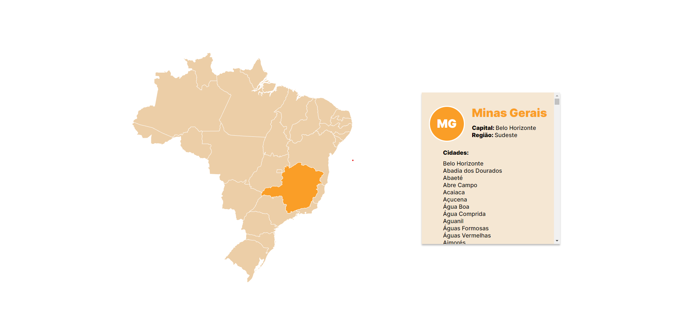

# Mapa dos estados do Brasil

---

Site que mostra o estado, capital, região e cidades ao clicar em determinado estado.

Esse site foi feito consumindo uma [API](https://github.com/yasmingcv/aulas-backend/tree/main/aula%2009) que lista os estados e cidades criada por mim.

---
## O que foi utilizado:
- HTML
- CSS
- JavaScript
- Arquivo SVG
- Consumo de API

---
## Autora:
[Yasmin Gonçalves]()